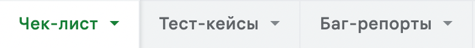

# Тестовое задание 

* <a href="#description">Тестовое задание</a>
* <a href="#stack">Инструменты</a>
* <a href="#sheets">Решение</a>
* <a href="#checklist">Чек-лист проверок</a>
* <a href="#add">Что еще можно проверить</a>
* <a href="#end">Заключение</a>

# <a id="description">Тестовое задание</a>

> Тестирование модуля `авторизации` и `аутентификации`

    
<h4>Полный текст тестового задания</h4>

  > Необходимо протестировать внедрение нового функционала на страницу входа в систему [https://dev1.onecell.ru/login](https://dev1.onecell.ru/login), а также написать тест-кейсы и провести тестирование этой страницы (модуль авторизации и аутентификации).
    Для этого у вас будет два существующих в системе пользователя (две пары логин\пароль)
    По найденным багам оформить баг-репорт с обязательными артефактами (как если бы вы заводили баг для разработчика)
    Тестовую документцию и баг-репорт предоставить в любом удобном для этого виде (гугл-таблицы или гугл-документ, ссылка на страницу в ноушен, текстовый файл, qase.io, testRail). 
    >* Можно выбрать формат тест-кейсов или чек-листа (в зависимости от того, что больше подходит под определенные вами сценарии тестирования)
    
  > Сейчас платформа не защищена от ботов. Можно сделать сколько угодно попыток ввода пароля.
    В качестве способа решения проблемы выбрано внедрение на платформу механизма Yandex SmartCaptcha. На стартовой странице логина в Платформе OneCell [https://dev1.onecell.ru/login](https://dev1.onecell.ru/login) кнопка “Я не робот” отсутствует.
    Окно с капчой (галочкой или заданием в зависимости от выбранного уровня сложности настроек капчи) увидят только те пользователи, которые не смогли авторизоваться определенное количество раз в соответствии с ниже описанными требованиями:
  
      1. Если совершено 5 не успешных попыток авторизации в течение 5 минут - показывается галочка «я не робот» 
         (либо задание для пользователя). Капча выключается 1 раз в 15 минут или при совершении успешной авторизации.
      2. Если совершено 10 не успешных попыток авторизации в течение 3 минут с одного IP - появляется галочка 
         «я не робот», либо задание для всех пользователей, в рамках IP.
         Капча в рамках IP выключается через 10 мин.

# <a id="stack">Инструменты</a>

  <code></code>
  <code></code>
  <code></code>

# <a id="sheets">Решение</a>

> Решение доступно в [Google Sheets](https://docs.google.com/spreadsheets/d/121ekFlx99Qs6NY9MyzqWRxpv_489Qrb1gMzEWK9RGps/edit?usp=sharing)

* Чек-лист, тест-кейсы и баг-репорты лежат в разных листах таблицы
</a>

К сожалению, возможности Google Sheets ограничены (Или я не шарю за таблицы 😃 ), поэтому добавление скринов выглядит костыльно.  
Скрины не лежат в ячейках, поэтому их можно увеличивать для удобства просмотра.  

Созданы тест-кейсы для проверки основных моментов авторизации и аутентификации. Те проверки, которые не сочел
нужным описывать в тест-кейсах, включены в чек-лист проверок

    
<h4>Названия тест-кейсов</h4>

>* Страница авторизации. Происходит  авторизация в платформе, при вводе логина и пароля, имеющихся в системе
>* Страница авторизации. Происходит  авторизация в платформе, при нажатии `Enter` с введенными логином и паролем, имеющихся в системе
>* Страница авторизации. При попытке авторизации с введенным логином или паролем, не имеющихся в системе, появляется сообщение об ошибке
>* Страница авторизации. Появляется сообщение об ошибке, при нажатии `Enter` с введенными логином и паролем, не имеющихся в системе
>* Страница авторизации. При попытке авторизации с не введенным логином или паролем, появляется сообщение об ошибке
>* Страница авторизации. При попытке авторизации пользователя, не имеющего доступ к платформе, появляется уведомление об ошибке
>* Страница авторизации. При нажатии кнопки восстановления пароля происходит переход на страницу восстановления пароля
>* Страница восстановления пароля. Система высылает на почту инструкцию по восстановлению пароля при вводе почты, имеющейся в системе
>* Страница восстановления пароля. Появляется сообщение об ошибке при вводе почты, не имеющейся в системе
>* Страница восстановления пароля. Появляется сообщение об ошибке при попытке восстановления пароля без ввода почты

Баг-репорты постарался описать максимально понятно и подробно. Кстати, заметил, что пару мелких багов есть на основном сайте.

    
<h4>Баги, которые нашел</h4>

>* Страница авторизации. При попытке авторизоваться за юзера, не имеющего доступ к платформе, появляются 2 одинаковых уведомления об ошибке
>* Страница авторизации. При попытке авторизоваться 2 раза подряд за юзера, не имеющего доступ к платформе, происходит авторизация
>* После авторизации, любой юзер может изменять свои данные и роль через Devtools во вкладке Application
>* Страница авторизации. При попытке авторизоваться за юзера, не имеющего доступ к платформе, перед появлением уведомления об ошибке доступа, происходит авторизация и деавторизация на платформе
>* Страница авторизации. Капча в рамках IP срабатывает вне зависимости от успеха авторизации после 10 попыток входа на сайт в течении 3-х минут
>* Страница восстановления пароля. Нет проверки на существование email в базе данных
>* Страница восстановления пароля. При попытке отправить инструкции, не заполнив email, не появляется сообщение об ошибке
>* На странице авторизации и восстановления пароля, когда поля заполнены автоматически, при клике на поле для редактирования не видно каретку

[Вернуться наверх ⬆](#lift)

# <a id="checklist">Чек-лист проверок</a>
> Отметил какие проверки удалось провести. Некоторые проверки невозможно сделать в рамках тестового задания из-за недостатка информации или отсутствия доступа к функциональности

- [x] Проверить, что модуль авторизации готов к тестированию и основные фукнциональности работают
- [x] Проверить, что Devtools не содержит ошибок
- [x] Проверить, что новая функциональность соответствует заданным требованиям и работает корректно
- [x] Проверить, что соединение происходит через `https` и веб-браузер показывает, что соединение защищено
- [x] Проверить, что сертификат `SSL/TLS` действителен 
- [x] Проверить, что курсор меняет свои состояния в зависимости наведения на разные объекты (Поля ввода, кнопки)
- [x] Проверить, что редактировать поля удобно. При клике на место редактирования появляется каретка и ее четко видно
- [x] Проверить, что на странице авторизации присутствуют поля для ввода логина и пароля, кнопки `Войти` и `Восстановить пароль`
- [x] Проверить что кнопки меняют свой цвет при наведении курсора
- [ ] Проверить, что поля для ввода логина и пароля не позволяют вводить больше символов, чем ограничено системой. (Нет инфы)
- [x] Проверить, что при вводе корректных данных пользователь авторизуется в системе и попадает на главную страницу
- [x] Проверить, что кнопка `показать/скрыть пароль` работает корректно (Меняется иконка, в зависимости от состояния, пароль показывается и скрывается)
- [x] Проверить, что при вводе некорректного логина и/или пароля пользователь не авторизуется и получает сообщение об ошибке.
- [x] Проверить, что при попытке авторизации в платформе, на которую у пользователя нет доступа, пользователь не авторизуется и получает сообщение об ошибке.
- [x] Проверить, что всплывающие уведомления в левом нижнем углу экрана можно закрыть
- [x] Проверить, что всплывающие уведомления в левом нижнем углу исчезают со временем
- [x] Проверить, что при попытке авторизации в платформе с пустыми полями логина и пароля, появляются сообщения об ошибке
- [x] Проверить, что появляется окно капчи с заданием после 5 неудачных попыток ввода логина и пароля.
- [x] Проверить, что капча выключается 1 раз в 15 минут или при совершении успешной авторизации.
- [x] Проверить, что появляется окно с капчой если совершено 10 не успешных попыток авторизации в течение 3 минут с одного IP
- [x] Проверить, что капча в рамках IP выключается через 10 мин.
- [x] Проверить, что при авторизации пользователя система выдает уникальный идентификатор сессии, который используется для подтверждения авторизации пользователя.
- [x] Проверить, что после авторизации, пользователь не может изменить себе через Devtools права доступа или другие данные
- [x] Проверить, что пользователь может перейти на страницу восстановления пароля
- [x] Проверить, что на странице восстановления пароля присутствуют поле для ввода почты, кнопка отправки письма на почту, кнопка возврата на страницу авторизации
- [x] Проверить, что на странице восстановления пароля кнопка возврата на страницу авторизации работает
- [ ] Проверить, что при вводе корректной почты, появляется сообщение об успешной отправке инструкции, а также приходит письмо с инструкциями на указанную почту 
- [ ] Проверить, что в высланной инструкции ссылка на страницу для ввода нового пароля действительна и открывает страницу без ошибок.
- [ ] Проверить, что ссылка действительна в течение заданного времени, после чего она перестает действовать.
- [ ] Проверить, что форма ввода нового пароля работает корректно, принимая и сохраняя новый пароль.
- [ ] Проверить, что форма проверяет новый пароль на соответствие требованиям безопасности (длина, использование специальных символов и т.д.).
- [ ] Проверить, что при вводе неправильного или несовпадающего пароля, система выводит соответствующее сообщение об ошибке.
- [ ] Проверить, что после успешного восстановления пароля, пользователь может авторизоваться с новым паролем и получает доступ к своей учетной записи.
- [x] Проверить, что при попытке восстановления пароля без ввода почты, появляется сообщение об ошибке
- [x] Проверить, что при попытке восстановления пароля с несуществующей почтой, появляется сообщение об ошибке и система не высылает письмо с инструкциями на почту
- [x] Проверить, что при попытке восстановления пароля с почтой некорректного формата появляется сообщение об ошибке и система не отправляет инструкции (корректный формат test@mail.com, некорректный формат - "12212.ру")
- [x] Проверить, что при клике на логотип компании в левом верхнем углу попадаем на главную страницу (В рамках тестового задания - на страницу авторизации)

[Вернуться наверх ⬆](#lift)

# <a id="add">Что еще можно проверить</a>
> Возможные проверки не в рамках тестового задания
1. Тесты на регистрацию пользователя и связанных функций
    * Валидация полей
    * Обработка ошибок
    * Корректность введенных данных на странице подтверждения
    * Письмо подтверждения приходит на почту и ссылка на подтверждение работает
    * Возможность после регистрации авторизоваться на сайте с введенными данными
    * Возможность удалить свой профиль. И т.д
2. Тесты двухфакторной аутентификации, если она есть
3. Проверки на возможность восстановления пароля (Проверки, которые указал в чек-листе)

# <a id="end">Заключение</a>

[Вернуться наверх ⬆](#lift)